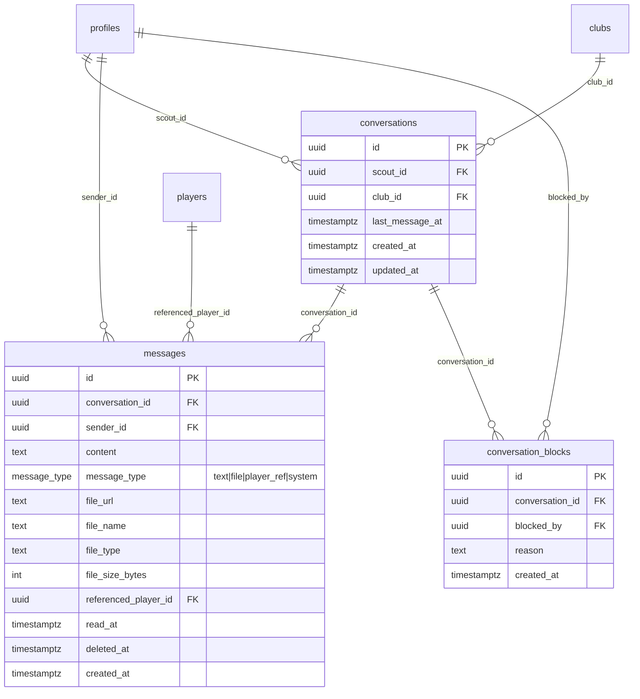

# Chat System Session A — Database & API Foundation

## Overview

Build the complete database layer and API routes for the real-time messaging system (Phase 6.5). This is the foundation that Sessions B–F will build upon. Scouts can message academy admins via one conversation thread per scout-club pair. Both sides can send text, files, and player references.

**Key architectural decision (deviation from spec):** Drop `academy_admin_id` from `conversations` table. Use `club_id` only — academy admin access is derived from `profiles.club_id`. This prevents conversation lockout when admins change, and supports multiple admins per club.

## Problem Statement / Motivation

The current contact request system is one-directional and clunky — scouts send a request, admins approve/decline, and there is no conversation flow. International scouts expect real-time communication. The chat system replaces contact requests entirely, enabling direct messaging between scouts and academies with file sharing and player references.

## Proposed Solution

### Phase 1: Database Migration

Create three tables (`conversations`, `messages`, `conversation_blocks`) with proper RLS policies, indexes, triggers, enum types, and Realtime enabled. Use established migration patterns (helper functions, SECURITY DEFINER for mark-read).

### Phase 2: Supabase Storage

Create `chat-attachments` private bucket with RLS restricting access to conversation participants.

### Phase 3: API Routes

Build 6 API endpoints handling conversation CRUD, message sending/loading/read-marking, and file uploads — all with rate limiting, block checks, and proper auth.

### Phase 4: Validation & Types

Add Zod schemas and TypeScript types so Session B has clear contracts to build against.

## Technical Approach

### Schema Changes from Original Spec

The original spec in `Chat-system-build.md` has been refined based on codebase analysis:

| Original Spec | Revised Decision | Reason |
|---|---|---|
| `academy_admin_id` in conversations | **Removed** — use `club_id` only | Admin turnover would orphan conversations; multiple admins per club |
| `is_read boolean` on messages | **→ `read_at timestamptz null`** | Supports "seen at" timestamps; null = unread |
| `message_type text` | **→ PostgreSQL enum** | Matches codebase pattern (`player_status`, `transfer_status`); data integrity |
| No `deleted_at` on messages | **Added `deleted_at timestamptz null`** | Future soft-delete support without migration |
| No `updated_at` on conversations | **Added with trigger** | Track metadata changes |
| Block check only in API | **Also in RLS INSERT policy** | Defense in depth — anon key is public |
| UPDATE policy for mark-read | **SECURITY DEFINER function** | Prevents content tampering via UPDATE |
| No platform_admin policies | **Added SELECT on all tables** | Moderation access |
| Realtime on messages only | **Both messages + conversations** | Inbox needs live updates when messages arrive |

### ERD Diagram



### Implementation Phases

#### Phase 1: Database Migration (`supabase/migrations/20250101000027_create_chat_system.sql`)

**1a. Enum type**

```sql
create type public.message_type as enum ('text', 'file', 'player_ref', 'system');
```

**1b. Conversations table**

```sql
create table public.conversations (
  id uuid primary key default gen_random_uuid(),
  scout_id uuid not null references public.profiles(id) on delete set null,
  club_id uuid not null references public.clubs(id) on delete cascade,
  last_message_at timestamptz default now(),
  created_at timestamptz default now(),
  updated_at timestamptz default now(),
  unique(scout_id, club_id)
);

create index idx_conversations_scout on public.conversations(scout_id);
create index idx_conversations_club on public.conversations(club_id);
create index idx_conversations_last_message on public.conversations(last_message_at desc);
```

**1c. Messages table**

```sql
create table public.messages (
  id uuid primary key default gen_random_uuid(),
  conversation_id uuid not null references public.conversations(id) on delete cascade,
  sender_id uuid references public.profiles(id) on delete set null,
  content text,
  message_type public.message_type not null default 'text',
  file_url text,
  file_name text,
  file_type text,
  file_size_bytes int,
  referenced_player_id uuid references public.players(id) on delete set null,
  read_at timestamptz,
  deleted_at timestamptz,
  created_at timestamptz default now()
);

create index idx_messages_conversation on public.messages(conversation_id, created_at desc);
create index idx_messages_sender on public.messages(sender_id);
create index idx_messages_unread on public.messages(conversation_id, sender_id, read_at)
  where read_at is null;
```

**1d. Conversation blocks table**

```sql
create table public.conversation_blocks (
  id uuid primary key default gen_random_uuid(),
  conversation_id uuid not null references public.conversations(id) on delete cascade,
  blocked_by uuid not null references public.profiles(id) on delete cascade,
  reason text,
  created_at timestamptz default now(),
  unique(conversation_id, blocked_by)
);

create index idx_conversation_blocks_conversation on public.conversation_blocks(conversation_id);
```

**1e. Enable RLS on all tables**

```sql
alter table public.conversations enable row level security;
alter table public.messages enable row level security;
alter table public.conversation_blocks enable row level security;
```

**1f. RLS Policies — Conversations**

```sql
-- Participants can view their conversations
-- Scout: scout_id match. Academy admin: club_id match via profile.
create policy "Participants view own conversations"
  on public.conversations for select
  using (
    auth.uid() = scout_id
    or (
      public.get_user_role() = 'academy_admin'
      and public.get_user_club_id() = club_id
    )
    or public.get_user_role() = 'platform_admin'
  );

-- Only scouts can create conversations
create policy "Scouts create conversations"
  on public.conversations for insert
  to authenticated
  with check (
    auth.uid() = scout_id
    and public.get_user_role() = 'scout'
  );
```

**1g. RLS Policies — Messages**

```sql
-- Conversation participants can read messages
create policy "Participants read messages"
  on public.messages for select
  using (
    exists (
      select 1 from public.conversations c
      where c.id = conversation_id
      and (
        c.scout_id = auth.uid()
        or (
          public.get_user_role() = 'academy_admin'
          and public.get_user_club_id() = c.club_id
        )
        or public.get_user_role() = 'platform_admin'
      )
    )
  );

-- Participants can send messages (with block check)
create policy "Participants send messages"
  on public.messages for insert
  to authenticated
  with check (
    sender_id = auth.uid()
    and exists (
      select 1 from public.conversations c
      where c.id = conversation_id
      and (
        c.scout_id = auth.uid()
        or (
          public.get_user_role() = 'academy_admin'
          and public.get_user_club_id() = c.club_id
        )
      )
    )
    and not exists (
      select 1 from public.conversation_blocks cb
      where cb.conversation_id = conversation_id
      and cb.blocked_by != auth.uid()
    )
  );
```

**1h. SECURITY DEFINER function for marking messages read**

```sql
create or replace function public.mark_messages_read(p_conversation_id uuid)
returns void
language plpgsql
security definer
set search_path = public
as $$
begin
  update public.messages
  set read_at = now()
  where conversation_id = p_conversation_id
    and sender_id != auth.uid()
    and read_at is null;
end;
$$;
```

**1i. RLS Policies — Conversation Blocks**

```sql
-- Participants can see blocks on their conversations
create policy "Participants view blocks"
  on public.conversation_blocks for select
  using (
    exists (
      select 1 from public.conversations c
      where c.id = conversation_id
      and (
        c.scout_id = auth.uid()
        or (
          public.get_user_role() = 'academy_admin'
          and public.get_user_club_id() = c.club_id
        )
        or public.get_user_role() = 'platform_admin'
      )
    )
  );

-- Academy admins can create blocks for their club's conversations
create policy "Academy admins create blocks"
  on public.conversation_blocks for insert
  to authenticated
  with check (
    blocked_by = auth.uid()
    and public.get_user_role() = 'academy_admin'
    and exists (
      select 1 from public.conversations c
      where c.id = conversation_id
      and public.get_user_club_id() = c.club_id
    )
  );

-- Academy admins can remove their own blocks
create policy "Academy admins remove blocks"
  on public.conversation_blocks for delete
  using (
    blocked_by = auth.uid()
    and public.get_user_role() = 'academy_admin'
  );

-- Platform admin can remove any block
create policy "Platform admin remove blocks"
  on public.conversation_blocks for delete
  using (
    public.get_user_role() = 'platform_admin'
  );
```

**1j. Triggers**

```sql
-- Update conversations.updated_at on changes
create trigger update_conversations_updated_at
  before update on public.conversations
  for each row execute function public.update_updated_at_column();

-- Update conversations.last_message_at when a message is inserted
create or replace function public.update_conversation_last_message()
returns trigger
language plpgsql
security definer
set search_path = public
as $$
begin
  update public.conversations
  set last_message_at = NEW.created_at
  where id = NEW.conversation_id;
  return NEW;
end;
$$;

create trigger on_message_insert_update_conversation
  after insert on public.messages
  for each row execute function public.update_conversation_last_message();
```

**1k. Enable Realtime**

```sql
alter publication supabase_realtime add table messages;
alter publication supabase_realtime add table conversations;
```

#### Phase 2: Supabase Storage Bucket

Create `chat-attachments` bucket via migration or seed. Configure:
- Private bucket (not public)
- File size limit: 10MB
- Allowed MIME types: `image/jpeg`, `image/png`, `image/gif`, `image/webp`, `application/pdf`, `application/msword`, `application/vnd.openxmlformats-officedocument.wordprocessingml.document`

Storage RLS policies:
- INSERT: authenticated users can upload to `{conversation_id}/` path if they are a participant
- SELECT: conversation participants can read files in their conversation's folder
- DELETE: not allowed (keep files permanently)

**Note:** Storage bucket creation in Supabase can be done via the `storage.buckets` table in a migration, or via the Supabase dashboard. The migration approach is preferred for reproducibility.

#### Phase 3: API Routes

All routes follow the pattern: validate input → check auth → check rate limits → check blocks → execute → return response.

**File: `src/app/api/conversations/route.ts`**

| Method | Description | Auth | Rate Limit |
|--------|-------------|------|------------|
| POST | Create or get existing conversation | Scout only | 10 new/day |
| GET | List user's conversations with metadata | Any authenticated | — |

POST request body: `{ club_id: string }`
POST response: `{ conversation: ConversationWithMeta }`
POST logic:
1. Validate `club_id` is a valid UUID
2. Auth check — must be a scout
3. Check if conversation already exists (`scout_id + club_id` pair)
4. If exists, return it (with metadata)
5. If not, check rate limit (10 new conversations/day)
6. If rate limit OK, insert new conversation
7. Insert system message: "Conversation started"
8. Return conversation with metadata

GET query params: none (derived from authenticated user)
GET response: `{ conversations: ConversationWithMeta[] }`
GET logic:
1. Auth check
2. If scout: fetch conversations where `scout_id = user.id`
3. If academy_admin: fetch conversations where `club_id = user's club_id`
4. Join: club name/logo, other party's name/org, last message, unread count, block status
5. Sort by `last_message_at DESC`

**ConversationWithMeta response shape:**

```typescript
interface ConversationWithMeta {
  id: string
  club: { id: string; name: string; name_ka: string; logo_url: string | null }
  other_party: { id: string; full_name: string; organization: string | null; role: string }
  last_message: { content: string | null; message_type: string; created_at: string; sender_id: string } | null
  unread_count: number
  is_blocked: boolean
  created_at: string
}
```

---

**File: `src/app/api/messages/route.ts`**

| Method | Description | Auth | Rate Limit |
|--------|-------------|------|------------|
| POST | Send a message | Participant (not blocked) | 30/hour/conversation |
| GET | Load messages (paginated) | Participant | — |

POST request body:
```typescript
{
  conversation_id: string
  content?: string              // required for text type
  message_type: 'text' | 'file' | 'player_ref'
  file_url?: string             // required for file type
  file_name?: string
  file_type?: string
  file_size_bytes?: number
  referenced_player_id?: string // required for player_ref type
}
```
POST logic:
1. Validate with Zod schema
2. Auth check — user is participant of conversation
3. Block check — conversation is not blocked (or user is not the blocked party)
4. Rate limit check — 30 messages/hour in this conversation
5. Insert message
6. Return message

GET query params: `conversation_id`, `before` (cursor — message ID), `limit` (default 50, max 100)
GET response: `{ messages: Message[], has_more: boolean }`
GET logic:
1. Validate `conversation_id`
2. Auth check — user is participant
3. Fetch messages ordered by `created_at DESC`
4. If `before` cursor: fetch messages with `created_at < cursor_message.created_at`
5. Limit to `limit + 1` to determine `has_more`
6. Return messages (reversed for chronological display by client)

---

**File: `src/app/api/messages/[conversationId]/read/route.ts`**

| Method | Description | Auth |
|--------|-------------|------|
| PATCH | Mark all unread messages as read | Participant |

PATCH logic:
1. Get `conversationId` from params (await — Next.js 16)
2. Auth check — user is participant
3. Call `supabase.rpc('mark_messages_read', { p_conversation_id: conversationId })`
4. Return `{ success: true }`

---

**File: `src/app/api/chat-upload/route.ts`**

| Method | Description | Auth | Rate Limit |
|--------|-------------|------|------------|
| POST | Upload file attachment | Participant | 5 files/day |

POST: multipart form data with `file` + `conversation_id`
POST response: `{ file_url: string; file_name: string; file_type: string; file_size_bytes: number }`
POST logic:
1. Parse multipart form data
2. Auth check — user is participant of conversation
3. Validate file type (extension + MIME type check)
4. Validate file size (max 10MB)
5. Rate limit check — 5 uploads/day
6. Upload to Supabase Storage: `chat-attachments/{conversation_id}/{uuid}.{ext}`
7. Generate signed URL (7-day expiry)
8. Return file metadata + signed URL

#### Phase 4: Validation Schemas & Types

**Add to `src/lib/validations.ts`:**

```typescript
export const createConversationSchema = z.object({
  club_id: z.string().uuid(),
})

export const sendMessageSchema = z.object({
  conversation_id: z.string().uuid(),
  content: z.string().min(1).max(5000).optional(),
  message_type: z.enum(['text', 'file', 'player_ref']),
  file_url: z.string().url().optional(),
  file_name: z.string().max(255).optional(),
  file_type: z.string().max(100).optional(),
  file_size_bytes: z.number().int().positive().max(10 * 1024 * 1024).optional(),
  referenced_player_id: z.string().uuid().optional(),
}).refine(
  (data) => {
    if (data.message_type === 'text') return !!data.content
    if (data.message_type === 'file') return !!data.file_url && !!data.file_name
    if (data.message_type === 'player_ref') return !!data.referenced_player_id
    return false
  },
  { message: 'Missing required fields for message type' }
)

export const loadMessagesSchema = z.object({
  conversation_id: z.string().uuid(),
  before: z.string().uuid().optional(),
  limit: z.coerce.number().int().min(1).max(100).default(50),
})
```

**Add to `src/lib/constants.ts`:**

```typescript
export const CHAT_LIMITS = {
  MAX_CONVERSATIONS_PER_DAY: 10,
  MAX_MESSAGES_PER_HOUR: 30,
  MAX_UPLOADS_PER_DAY: 5,
  MAX_FILE_SIZE_BYTES: 10 * 1024 * 1024, // 10MB
  MAX_MESSAGE_LENGTH: 5000,
  MESSAGES_PER_PAGE: 50,
  SIGNED_URL_EXPIRY_SECONDS: 7 * 24 * 60 * 60, // 7 days
} as const

export const ALLOWED_CHAT_FILE_TYPES = [
  'image/jpeg', 'image/png', 'image/gif', 'image/webp',
  'application/pdf', 'application/msword',
  'application/vnd.openxmlformats-officedocument.wordprocessingml.document',
] as const

export const ALLOWED_CHAT_FILE_EXTENSIONS = [
  '.jpg', '.jpeg', '.png', '.gif', '.webp', '.pdf', '.doc', '.docx',
] as const
```

**Add to `src/lib/translations.ts`:**

```typescript
// Under errors section
'errors.rateLimitConversations': {
  en: "You've reached the daily conversation limit. Try again tomorrow.",
  ka: 'დღიური საუბრების ლიმიტი ამოიწურა. სცადეთ ხვალ.',
},
'errors.rateLimitMessages': {
  en: "You're sending too many messages. Please wait.",
  ka: 'ძალიან ბევრ შეტყობინებას აგზავნით. გთხოვთ მოიცადოთ.',
},
'errors.rateLimitUploads': {
  en: "You've reached the daily file upload limit.",
  ka: 'დღიური ფაილების ატვირთვის ლიმიტი ამოიწურა.',
},
'errors.conversationBlocked': {
  en: 'This conversation has been closed by the academy.',
  ka: 'ეს საუბარი დაიხურა აკადემიის მიერ.',
},
'errors.fileTooLarge': {
  en: 'File is too large. Maximum size is 10MB.',
  ka: 'ფაილი ძალიან დიდია. მაქსიმალური ზომაა 10MB.',
},
'errors.fileTypeNotAllowed': {
  en: 'This file type is not allowed.',
  ka: 'ამ ტიპის ფაილი დაშვებული არ არის.',
},
'chat.conversationStarted': {
  en: 'Conversation started',
  ka: 'საუბარი დაიწყო',
},
```

## System-Wide Impact

### Interaction Graph

- `POST /api/messages` → inserts message → triggers `on_message_insert_update_conversation` → updates `conversations.last_message_at` → Supabase Realtime broadcasts to subscribers on both `messages` and `conversations` channels
- `POST /api/conversations` → inserts conversation → inserts system message → triggers same chain
- Block/unblock → inserts/deletes `conversation_blocks` row → checked by RLS on next message INSERT

### Error Propagation

- API route errors return JSON `{ error: string }` with appropriate HTTP status codes (400, 401, 403, 429, 500)
- Rate limit errors return HTTP 429 with i18n error keys
- Supabase RLS violations return 403 via the Supabase client `.error` field
- File upload errors (size, type) return 400 with specific error keys
- All errors use translation keys for bilingual display

### State Lifecycle Risks

- **Orphaned files:** If `POST /api/chat-upload` succeeds but the subsequent `POST /api/messages` fails, a file exists in storage without a message reference. Mitigation: acceptable at current scale (10MB max, 5/day limit). Can add cleanup job in Phase 8.
- **Partial conversation creation:** If conversation INSERT succeeds but system message INSERT fails, conversation exists without a welcome message. Mitigation: wrap in a try/catch, log the error, don't fail the whole operation — the conversation is still valid.
- **last_message_at desync:** If the trigger fails, the conversation's `last_message_at` won't update. Mitigation: the trigger is SECURITY DEFINER and simple — failure is unlikely. If it occurs, the inbox sort order is slightly off until the next message.

### API Surface Parity

- Chat API routes are new — no existing interfaces need updating
- The `contact_requests` system continues to work until Session E removes it
- The `ActionResult<T>` type pattern from server actions can be adapted for API route responses

### Integration Test Scenarios

1. Scout creates conversation → sends message → admin receives via Realtime → admin marks as read → scout's message shows read timestamp
2. Admin blocks scout → scout attempts to send message → RLS rejects → API returns blocked error → admin unblocks → scout can send again
3. Scout hits 30-message rate limit → API returns 429 → scout waits → rate limit resets → scout can send
4. Scout uploads file exceeding 10MB → API returns 400 → scout uploads valid file → signed URL returned → admin can access file
5. Multiple admins for same club → both can see and respond to conversations with that club's scouts

## Acceptance Criteria

### Functional Requirements

- [x] `conversations`, `messages`, `conversation_blocks` tables exist with correct schema
- [x] `message_type` PostgreSQL enum with values `text`, `file`, `player_ref`, `system`
- [x] `read_at timestamptz` on messages (null = unread)
- [x] `deleted_at timestamptz` on messages (null = not deleted)
- [x] All RLS policies enforce participant-only access
- [x] RLS INSERT on messages includes block check
- [x] `mark_messages_read()` SECURITY DEFINER function prevents content tampering
- [x] Platform admin can SELECT all chat tables
- [x] `last_message_at` auto-updates via trigger on message INSERT
- [x] Realtime enabled on both `messages` and `conversations` tables
- [x] `chat-attachments` Storage bucket exists (private, 10MB limit)
- [x] `POST /api/conversations` creates or returns existing conversation
- [x] `GET /api/conversations` returns conversations with club info, other party info, last message, unread count, block status
- [x] `POST /api/messages` sends messages with rate limit + block checks
- [x] `GET /api/messages` returns paginated messages (cursor-based, 50 default)
- [x] `PATCH /api/messages/[conversationId]/read` marks messages as read via RPC
- [x] `POST /api/chat-upload` uploads files with type/size validation and rate limit
- [x] Rate limit: 10 new conversations/scout/day
- [x] Rate limit: 30 messages/user/conversation/hour
- [x] Rate limit: 5 file uploads/user/day
- [x] Rate limit violations return HTTP 429 with i18n error keys
- [x] All file uploads validated by both extension and MIME type
- [x] Zod schemas added to `validations.ts`
- [x] Chat constants added to `constants.ts`
- [x] All i18n strings added in both English and Georgian
- [x] `database.types.ts` regenerated after migration
- [x] `npm run build` passes with zero errors

### Non-Functional Requirements

- [ ] API responses under 200ms for conversation list and message load
- [ ] Cursor-based pagination prevents duplicate/missing messages during real-time activity
- [ ] No `any` types — proper TypeScript throughout
- [ ] All Supabase `.error` checked before using `.data`

## Dependencies & Prerequisites

- Supabase local instance running (`npx supabase start`)
- Existing `get_user_role()` and `get_user_club_id()` SECURITY DEFINER functions (from migration 13)
- Existing `update_updated_at_column()` trigger function (from migration 11)
- Current branch: `feat/advanced-player-filters` — may need to create a new branch or work on this one

## Risk Analysis & Mitigation

| Risk | Impact | Mitigation |
|------|--------|------------|
| RLS recursion with conversations ↔ messages policies | Breaks all chat queries | Use `get_user_role()` / `get_user_club_id()` helpers (proven pattern from migration 13) |
| Supabase Realtime not broadcasting | Chat feels broken in Session B | Test Realtime subscription in a simple client component after enabling |
| Storage bucket RLS too restrictive | File uploads fail silently | Test upload + signed URL flow end-to-end |
| Rate limit queries slow at scale | Message sending feels laggy | Indexes on `(sender_id, conversation_id, created_at)` already planned |
| `ON DELETE SET NULL` on sender_id | Orphaned messages display weird | Handle null sender in UI as "Deleted user" (Session B concern) |

## Build Order (Step-by-Step)

1. **Create migration file** `supabase/migrations/20250101000027_create_chat_system.sql`
   - Enum type, all 3 tables, indexes, RLS, triggers, functions, Realtime
2. **Push migration** `npx supabase db push` (or reset local)
3. **Create Storage bucket** via migration or Supabase dashboard
4. **Regenerate types** `npx supabase gen types typescript --local > src/lib/database.types.ts`
5. **Add Zod schemas** to `src/lib/validations.ts`
6. **Add constants** to `src/lib/constants.ts`
7. **Add i18n strings** to `src/lib/translations.ts`
8. **Build API route:** `src/app/api/conversations/route.ts` (POST + GET)
9. **Build API route:** `src/app/api/messages/route.ts` (POST + GET)
10. **Build API route:** `src/app/api/messages/[conversationId]/read/route.ts` (PATCH)
11. **Build API route:** `src/app/api/chat-upload/route.ts` (POST)
12. **Run `npm run build`** — fix any TypeScript errors
13. **Commit**

## Sources & References

### Origin

- **Spec document:** [Chat-system-build.md](../../Chat-system-build.md) — comprehensive chat system architecture and build plan. Key decisions carried forward: one conversation per scout-club pair, Supabase Realtime subscriptions, anti-spam rate limits, file type restrictions, block system.

### Internal References

- Migration patterns: `supabase/migrations/20250101000013_fix_rls_recursion.sql` — `get_user_role()` and `get_user_club_id()` helper functions
- Trigger pattern: `supabase/migrations/20250101000011_add_updated_at.sql` — `update_updated_at_column()` function
- API route pattern: `src/app/api/players/[id]/pdf/route.ts` — auth checking, Next.js 16 params handling
- Server action pattern: `src/app/actions/contact.ts` — validation → auth → DB → return pattern
- Validation patterns: `src/lib/validations.ts` — Zod schema conventions
- Auth helpers: `src/lib/auth.ts` — `getAdminContext()`, `getPlatformAdminContext()`
- Types: `src/lib/types.ts` — `ActionResult<T>`, `UserRole`, custom type patterns
- Constants: `src/lib/constants.ts` — existing constant patterns

### Related Work

- Phase 6.5 checklist in CLAUDE.md
- Existing contact request system: `src/app/actions/contact.ts`, `src/components/forms/ContactRequestForm.tsx`
